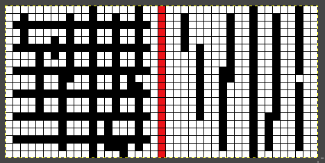
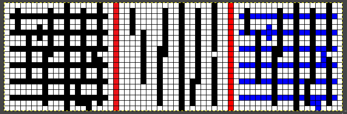

> Конференция SpectrumData 2022 

# Большая заочная задача на тему обработки изображений

Корневой репозиторий - https://github.com/spectrum-data/conf2022_images

## Общая вводная
Что значит "большая" - это небольшой "проект" и задачи в него еще будут добавляться.

Почему обработка изображений, хотя нам с этим мало приходится связываться? -

1. как раз чтобы поработать по темам с которыми мало приходилось связываться
2. продолжаем тему общих программистких навыков, связанных с продумыванием логики,
отладки алгоритма, оптимизацией; наша обычная работа часто сводится де-факто к скриптованию
вызовов готовых классов и библиотек и этот навык замыливается
3. обработка изображений - это как раз область где нужно немного подумать, поисследовать,
поизобретать

Естественно задачи будут достаточно простыми, но решать их надо будет именно своим умом

1. не используя готовых библиотек
2. не используя копипасты каких-то алгоритмов

Также эта задача весьма и весьма пригодна и для режима тестового боя (шаблон теста предельно формализован) - 
и кто хочет решать ее именно так - ниже это тоже будет описано.

## Kotlin

Эта задача предполагает выполнение на Kotlin, и соответственно для тех, кто с
этим языком еще не работал - есть шанс с ним поработать.

Я постарался учесть то, что выполнять будут не только люди знакомые с языком:

1. сырье для тестов проекта никак не связаны с языком - в принципе можно взять тот же набор
тестовых данных и реализовать все на удобном Вам языке
2. у задачи используется самый примитивный дизайн API чтобы можно было
решать задачу просто программируя функции (шаблон которых уже есть) и добавляя данные для тестов,
но не требуется формировать с нуля тестовые среды или какие-то базовые классы
3. но чтобы освоиться в kotlin побыстрее я вставил комментарии с префиксом `//NEWBE:` и в этих
комментариях сделал особые замечания по вещам которые как мне кажется не понятны, если никогда
не работать с Java/Kotlin

## Среда разработки

1. Если вы не Kotlin-разработчик - Установите JetBrains IDEA Community Edition - последнюю версию -
  Java, Kotlin и весь их стек будут установлены вместе с ней
2. Из плагинов достаточно установить `Kotest` чтобы легко прямо из идеи вызывать отдельные тесты
3. Установите любой удобный Вам редактор изображений, обязательно чтобы в нем была возможность
  показать пиксельную сетку и попиксельно же редактировать - на Linus я лично себе поставил Gimp

Больше ничего не потребуется.

# Определитесь как Вы будете это все выполнять

Я напомню что по итогам голосования мы ввели на конференции возможность самоопределиться участнику
как он делает то или иное задание

1. персонально или в группе
2. в закрытую или в открытую (видны ли ваши решения другим в свободном доступе, в том числе во время работы)
3. в соревновательном режиме или без

Это большая задача, которая будет являться одной из основных в заочной части и ее можно делать
в любом из этих форматов, включая соревнование в режиме тестового боя.

Выберете соответствуюший вариант 

1. если вы выбрали работать группой - значит нужно определиться на чьей учетке github вы это будете делать,
а также сообщить состав группы организаторам
2. если вы выбрали работу персонально - репозиторий будет в Вашем личном github
3. если вы работаете в открытую - совсем нет сложностей - вы делаете fork проекта https://github.com/spectrum-data/conf2022_images
и работаете в нем
4. если вы работаете в закрытую - то надо создать проект через `Import Repository`, сделав его приватным,
  а затем уже склонировав себе выполнить `git remote add basis git@github.com:spectrum-data/conf2022_images.git`
  и соответственно вы сможете подкачяивать себе обновления или делать MR в общий, но при этом 
  какие-то бранчи и часть работы может быть скрыта
5. если вы решили что соревнование Вам не интересно - то просто делайте задачу в любом объеме
  со своими тестами, не беспокоясь о том сколько кейсов вы сделали или придумали - сколько
  получилось - столько и сделали
6. если же решили соревноваться - то по сути соревнование простое:
   1. чем больше реализовано стандартных кейсов в вашем коде - тем лучше
   2. чем больше реализовано чужих и нестандартных кейсов - еще лучше
   3. чем больше вы придумали своих оригинальных кейсов (но корректных в рамках ТЗ) - отлично!
   4. если вы еще и сами реализовали свои оригинальные кейсы - отлично!
   5. если еще вы ралшизовали, а другие нет - то совсем хорошо

> По тестовому бою. Формула расчета еще понятно будет уточняться, но она будет достаточно простой и прозрачной.
И точно будет в отличие от того года учтено то, что мы все же программисты, а не аналитики и 
свои тесты, но которые вы сами не реализовали - будут стоить мало, а если окажется, что вы
их придумали, сами не реализовали, а другие реализовали - вот им будет доп. бонус.

# Перейдем к самому проекту

Легенда. После третьей мировой войны осталась только JAVA и Kotlin - где-то осталась копия JDK.
Нет специальной литературы по обработке изображений, нет никаких готовых библиотек, но
есть вот стандартный пакет JDK `java.awt.image` с примитивами для работы с растрами и все.

Ну и понятно, что надо восстанавливать умение работать с изображениями.

Также известно что задачи конечные нам будут раскрывать только если более простые этапы 
решены и уже понятно что есть перспектива.

Хотя остался JAVA/Kotlin тим лид проекта хочет, чтобы как можно больше разных разрабов 
могло участвовать, и чтобы если вдруг сталкеры найдут еще языки можно было быстро и на них порт 
сделать - поэтому минимум ООП фишек и Java специфики и побольше просто обычного процедурно-функционального хардкора.

И еще - нельзя выкачать ни откуда никаких зависимостей - (`build.gradle.kts` - неприкосновенен ))


> Ну и собственно пока у нас будет в проекте некторое упрощение
> 
> 1. Все матрицы будут использовать стандартные ARGB пиксели (32бит) и никаких других вариантов представления
> 2. Но при этом почти все задачи будут считать его 2-х цветными - что есть "фон" и "фигура"
> 3. По умолчанию - фон - белый цвет, фигура - черный цвет, но их можно перекрыть
> 4. Но это именно начальное допушение и по мере развития появятся задачи где и со цветом придется поработать

## Что собственно надо сделать?

Обхяснить легко можно на первой задаче, которая уже есть:

1. Есть пустой шаблон функции [cleanNonBlockedPixels2C](src/main/kotlin/conf2022/images/task/cleanNonBlockedPixels.kt)
2. Собственно ее и надо реализовать. Что она должна делать описано в ее документации:
```kotlin
/**
 * Замещает в двуцветной матрице [image] цвет [foreground] на [background]
 * в тех случаях, если пиксель не включен в блок своего
 * цвета минимальным размером [minwidth] * [minheight]
 *
 * Дополнительный контракт.
 * 1. Если встречается пиксель не являющися [foreground] - то он рассматривается тоже как фоновый и никак не замещается
 * 2. Блоком "своего цвета" является непрерывный (без пикселей другого цвета) прямоугольник
 * 3. "Минимальный размер" значит, что если `minwidth=3` и `minheight=3` то блок 3x3 , 4x3, 4x5 подходят, а блоки
 *    2x2, 3x2, 2x3, 10x2 - нет
 *
 * Кейсы для данного метода лежат в `src/test/resources/CleanNonBlockedPixels2CTest
 *
 * > Имя файла содержит две переменных - для `minwidth` и `maxheight`, обязательно!
 */
fun cleanNonBlockedPixels2C(
    image: BufferedImage,
    minwidth: Int,
    minheight: Int = minwidth,
    foreground: Color = Color.BLACK,
    background: Color = Color.WHITE,
) {
    //TODO:собственно надо реализовать
}


```
3. Вы естественно можете посмотреть в ее тесткейсы, а тесткейс выглядит примерно так:

`src/test/resources/CleanNonBlockedPixels2CTest/ex004_5_1.png` ,

что под микроскопом:

,

Что значит "Имя файла содержит две переменных - для `minwidth` и `maxheight`, обязательно!" в документации
этой функции? 

Имена и структура изображений строятся по определенной схеме `<anyname>[_<var>]*.png`

То есть имя `ex004_5_1.png` содержит 2 переменные `[5, 1]` которые трактуются как `minwidth` и `minheight`

Ну и таких кейсов может быть много и лежат они в директории `src/test/resources/<functionName.toPascalCase()>Test`,
например для этой первой фунеции [тут](src/test/resources/CleanNonBlockedPixels2CTest)

4. Сам кейс состоит из 2х частей разеделеннх красной полосой - слева-вход, справа-ожидаемый выход

5. В принципе даже если функция пустая никто не может помешать запустить ее [основной тест](src/test/kotlin/conf2022/images/task/CleanNonBlockedPixels2CTest.kt)

6. Если вы еще ничего не реализовали, то тест "завалится" и в своем отчете он напишет что-то вроде

`result image not match expected, look at build/reports/images/cleanNonBlockedPixels2C/ex005_1_5_result.png: DiffStat(checked=400, matched=317, added=83, removed=0, missed=0)`

Как это понимать?
1. Есть статистика сколько точек на совпало и в какую сторону 
   - `added` - это лишние добавленные или сохраненные черные точки (цвет изображения), 
   - `removed` - это лишние стирания и сброс на белый цвет  (цвет фона)
   - `miscolor` - это если кроме черного и белого попались другие цвета - он не знает что с 
   ними делать (напомню что у нас только допущение что мы используем 2 цвета, а сам формат
   изображения позволяет любой цвет использовать)
2. Действительно в папку `build/reports/images/cleanNonBlockedPixels2C` будет положен 
файл с визуальны представлением этого diff, например для пустой реализации нашей функции,
это выглядит так:

,

В данном случае - наша пустая функция ничего не вычистила и соответственно
пиксели, которые она должна была удалить отмечены синим

1. `added` - синий
2. `removed` - красный
3. `missColor` - любой левый цвет - желтый

> Ну все! Вы один на один с набором картинок, тестом и пустой функцией!

7. Теперь собственно можно написать функцию и зазеленить тест!

# Развитие общей кодобазы

В этом задании кроме написания непосредственно реализации функций можно
развивать (в открытую) общую кодобазу и контрибутить в общий шаблон для всех.

Весь общий код сосредоточен в пакете `conf2022.image.common` - это
именно общйи код для всех, общие утилиты.

Соответсвенно некоторый обший код

1. для основной фуникцональность есть в [src/main/kotlin/conf2022/images/common](src/main/kotlin/conf2022/images/common)
2. общие классы для тестов, в том числе шаблонные готовые тесты в [src/test/kotlin/conf2022/images/common](src/test/kotlin/conf2022/images/common)

Если вы хотите исправить что-то в общей кодобазе, то вы (скрыв свои секреты если хотите)
готовите патч или бранч для контрибута и заливаете его в общую кодобазу
через MR.


# Особые "персональные" расширения

Не важно делаете ли вы что-то в открытую или закрытую, но может появиться НЕ ОБЩИЙ код, который
в то же время и не вмещается в один файл с реализуемой основной фукнкцией.

Это может касаться как основного кода, так и тестов (например свои специальные тесты).

При этом мы же возможно когда захотим все объединить в один репозиторий.

Чтобы избежать наложений и непоняток "чей это вещь?" код должен жить в "вендорном" пакете
вида `conf2022.images.usr.<usrname>` - где `usrname` - ваше (или группы) уникальное имя - 
это может быть логин какой-нибудь. Это касатеся как `main` так и `test`


# Особая зона `conf2022.images.task`

Этот пакет специфический - он содержит собственно заготовки под задачи.

Но по этому пакету особое правило - он не должен содержать каких -то новых файлов и непредусмотренных
функций или классов! Только вот те функции которые назначил к исполнению "тимлид"!

Это значит что 

1. новые файлы в этот пакет добавлять нельзя
2. если вы добавили в файлы еще какие-то функции или классы они все должны иметь видимость `private`
и быть видны только в этом файле соответственно
3. если не удалось все сделать по-простому и нужна куча классов - делаете их в "персональных расширяниях" или
 публикуете как "общие классы" и тут уже используете

С тестами все еще строже - `conf2022.images.task` - вообще неизменная зона! Тут ничего нельзя менять.
Все тесты заранее подготовлены "тимлидом" и менять их нельзя!

Если нужно что-то особое - смотрите предыдущий раздел.

# Дополнительные тесты для общих функций

Это прежде всего для тестового боя, но никто не мешает их также добавлять и потом не участвовать
в тестовом бое.

Допустим вы придумали особую картинку для проверки какой-то функции, корнер-кейс и т.д.

Как вы уже поняли - есть строгое соглашение об именованиях в этом проекте - от имени функции зависит имя теста,
а имя теста определяет где живут входные тестовые изображения и результирующие.

Тестовые изображения от "тимлида" имеют имена без собак `@` например `base010_3_3.png`.

Ну и для простоты работы с этой кодобазой есть соглашение некоторое об именах

1. `base` - это совсем простенькие кейсы
2. `ex` - более сложные расширенные
3. потом идет номер - трехзначный

В итоге примеры отсортированы по простоте и в некотором фиксированном порядке.

Чтобы добавить свой тест мы будем использовать такую нотацию: например, `base@usrname001_3_3.png`, где `usrname` - то же что
вами использовалось в спец-пакете `conf2022.images.usr.<usrname>` 

такая нотация
1. оставит упорядочение по значимости
2. оставит тесты тимлида выше
3. разведет тесты разных участников по группам
4. внутри группы упорядочит при этом дополнительно

# Бенчмаркинг

Пока это задание про функцию больше чем про производительность.

Но во-первых контроль производительности никто не отменял, во-вторых шаблонный тест
данного проекта уже заодно является и бенчмарковым шаблоном.

Если выполнить не задачу `test` , а задачу `benchmark` gradle то выполнятся бенчмарки, на CI они тоже выполнятся.

Базовый бенчмарк - это просто выполнение все тех же тестовых кейсов, но без контроля 
успешности, а просто на время.

Но также можно добавить и специальные изображения для бенчмаркинга.

Пример - [здесь](src/test/resources/CleanNonBlockedPixels2CTest/main_4_4.benchmark.png)

Бенчмарковые изображения не имеют двух половин, а являются просто изображениями (обычно гораздо большего размера чем тестовые примеры).

Главное их отличие в названии, если тест это `base001_2_2.png` , то бенчмарк это `base001_2_2.benchmark.png`,
то есть дополнительное внутреннее расширение `.benchmark`.

Эти изображения участвуют только в бенчмарках, а в тестах не участвуют.

Если захотите добавить какие-то свои особые бенчмарки - нотация такая же как и у тестов - вставлять `@usrname` между
префиксной частью имени и порядковым номером.

# Для тех кто не работал с Kotlin

В принципе для решения первой задачи вам достаточно изучить

1. определение переменных в kotlin
2. базовые типы (Int, Bool)
3. циклы, ветвления
4. базовые коллекции - list, может map
5. посмотреть API классов в пакете `javax.awt.image` прежде всего как работать в `BufferedImage`
6. может быть как определять простые классы и "структуры" (`data class`)

То есть точно не должно потребоваться глубокое изучение Java/Kotlin и знание каких-то суперхаков и практик.

Также сморите по мере возможности "общую часть кода" и комментарии `//NEWBE:`

# Для наоборот матерых Kotlin-истов

Посмотрите как я сделал гибрид теста и бенчмарка в одном флаконе, что в данном
случае очень удобно: [ImageTestSpecBase](src/test/kotlin/conf2022/images/common/ImageTestSpecBase.kt)

Ну и в целом учитывая всякую специфику этого проекта довольно лаконичная тестовая среда получилась.

> Очень надеюсь, что инструкция хотя и огромная, но понятная.
> Также надеюсь, что как и с GoLang смогли поучаствовать 
> Успехов в решении!!!
